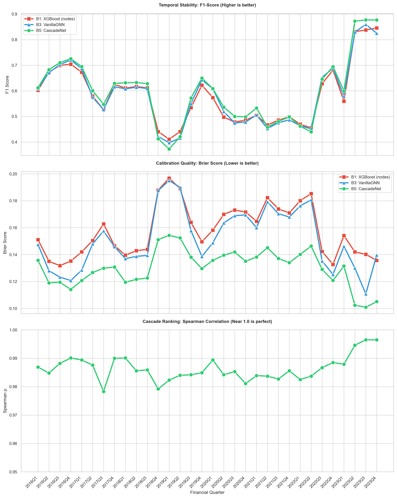

# CascadeNet — Stress-Conditioned Cascade Risk Predictor

A graph neural network for joint prediction of bank defaults and systemic cascade sizes in interbank networks under macroeconomic stress.

## What it does

Given an interbank lending network and a macro-stress scenario, CascadeNet simultaneously:

1. **Predicts which banks default** (binary classification per node)
2. **Estimates cascade size** — how many additional defaults each bank would trigger via contagion

The model uses FiLM (Feature-wise Linear Modulation) to condition GNN message passing on stress parameters, and multi-head GAT attention for neighbor aggregation.

## Architecture

```
Stress vector s ∈ R^8
       │
       ├──→ StressEncoder → (γ, β) per GNN layer
       │
Node features x ∈ R^70 ──→ [x; s] ──→ InputProj ──→ GATConv+FiLM ×4 ──→ ┬─ PD Head    → P(default)
                                                                           └─ Cascade Head → E[cascade size]
```

**Key design choices:**

- **FiLM conditioning**: stress modulates aggregated messages multiplicatively (`γ·agg + β`), not just via concatenation — the model can amplify or suppress neighbor signals depending on macro conditions
- **GAT aggregation**: 4-head attention learns which counterparty relationships matter most
- **Dual head with gate**: cascade prediction = `σ(gate) × softplus(magnitude)`, separating "will there be a cascade?" from "how big?"
- **Eisenberg-Noe simulation**: ground truth cascade sizes are computed via full fixed-point clearing (no linear approximation), parallelized across all N nodes per scenario

## Results

Evaluated independently on 32 quarters (2016Q1–2023Q4) from the [AI4Risk interbank dataset](https://github.com/AI4Risk/interbank). Each quarter: 200 stress scenarios, 140/30/30 train/val/test split.

### Default prediction (Head A) — aggregated across 32 quarters

| Model | AUROC | Brier ↓ | F1 | Best Brier wins |
|-------|-------|---------|-----|-----------------|
| B1: XGBoost (node features) | **0.838** | 0.158 | 0.581 | 0/32 |
| B3: VanillaGNN | 0.833 | 0.152 | 0.578 | 0/32 |
| **B5: CascadeNet** | 0.836 | **0.131** | **0.600** | **32/32** |

*CascadeNet wins Brier score in every single quarter tested. It matches or exceeds baselines on AUROC in most quarters, and consistently leads on F1.*

**Where CascadeNet shines brightest**: in high-contagion quarters (2023Q2–Q4), where 70%+ of defaults are contagion-driven, CascadeNet outperforms all baselines by 2–5 AUROC points. FiLM conditioning becomes clearly valuable (all ablation checks ✓) when network effects dominate.

### Cascade prediction (Head B)

| Metric | Mean across 32 quarters | Range |
|--------|------------------------|-------|
| Spearman ρ | 0.987 | 0.978 – 0.997 |

*No baseline has this capability — it's a free addition from the multi-task architecture.*

### Temporal stability (2016Q1 – 2023Q4)



Key findings across 32 quarters:
- **Calibration**: CascadeNet achieves the best Brier score in all 32 quarters — the green line is always below the others
- **F1**: CascadeNet leads in most quarters, with a dip during 2018Q4–2019Q2 (low-contagion periods where network structure matters less)
- **Cascade ranking**: Spearman ρ > 0.98 throughout, rising to 0.997 in high-contagion quarters

## Ablation study

Ablation on 2022Q4 (representative quarter):

| Ablation | ΔAUROC | Finding |
|----------|--------|---------|
| B5a: PD-only (no cascade loss) | +0.0005 | Cascade loss doesn't hurt classification |
| B5b: StopGrad (detached cascade) | −0.0004 | Shared backbone works fine |
| B5 vs B4: FiLM vs skip-concat | +0.0019 | Small advantage for FiLM |

Temporal pattern across 32 quarters:
- **FiLM value (B5 vs B3)**: positive in 19/32 quarters, strongly positive (+2–5%) in high-contagion quarters (2023Q2–Q4)
- **Skip value (B5 vs B4)**: positive in 29/32 quarters — CascadeNet consistently outperforms stress-skip baseline
- **Best Brier**: CascadeNet wins 32/32 quarters regardless of contagion level

## Data

Uses the [AI4Risk/interbank](https://github.com/AI4Risk/interbank) dataset:
- **Nodes**: 4,548 banks with 70 financial features (total assets, equity, liquidity ratios, CET1, etc.) + credit ratings (A–D)
- **Edges**: 12,461 interbank exposures with weights
- **Quarters**: 2016Q1 – 2023Q4 (32 quarters, all evaluated independently)

Stress scenarios are generated synthetically: a random stress vector `s ∈ [0,1]^8` determines macro conditions → stochastic bank defaults → Eisenberg-Noe cascade simulation → ground truth labels.

## Quick start

```bash
# Clone and setup
git clone https://github.com/YOUR_USERNAME/cascade_net.git
cd cascade_net

# Install dependencies
pip install torch torch-geometric numpy scipy pandas networkx xgboost joblib scikit-learn matplotlib tqdm

# Download data
git clone https://github.com/AI4Risk/interbank.git
cp -r interbank/datasets data/interbank/

# Run (single quarter)
python main.py --quarter 2022Q4

# Run with ablations
python main.py --quarter 2022Q4 --ablation

# Quick test (small config for debugging)
python main.py --synthetic --quick
```

## Project structure

```
cascade_net/
├── config.py                  # All hyperparameters
├── data/
│   ├── interbank/             # All datasets
├── datapipe/
│   ├── __init__.py
│   ├── loader.py              # AI4Risk dataset loader + synthetic fallback
│   ├── cascade.py             # Eisenberg-Noe simulation (parallelized)
│   └── scenarios.py           # Stress scenario generation & splits
├── evaluation/
│   ├── __init__.py
│   ├── runner.py              # Run B1–B6, collect metrics
│   ├── metrics.py             # AUROC, AUPRC, Brier, Spearman ρ
│   └── visualization.py       # 4-panel results figure
├── models/
│   ├── __init__.py
│   ├── stress_encoder.py      # FiLM encoder (γ/β generation)
│   ├── gnn_layers.py          # GAT+FiLM, VanillaGNN, StressSkipGNN layers
│   ├── heads.py               # Dual head (PD + cascade gate/magnitude)
│   ├── cascadenet.py          # Full model assembly
│   └── baselines.py           # B3: VanillaGNN, B4: StressSkipGNN
├── training/
│   ├── __init__.py
│   ├── loss.py                # Multi-task loss with staged cascade weight
│   ├── trainer.py             # CascadeNet trainer (grad accumulation)
│   └── baseline_trainer.py    # Baseline GNN trainer
└── main.py                    # Pipeline entry point
```

## Technical details

**Scenario generation**: each scenario samples a stress vector, computes per-bank default probabilities (based on credit rating + financial health + stress sensitivity), stochastically samples initial defaults, then runs Eisenberg-Noe clearing to determine contagion defaults. Cascade sizes are computed separately for each node as trigger via parallelized fixed-point iteration.

**Training**: AdamW with cosine annealing LR, gradient accumulation over 4 scenarios, staged cascade weight (0.05 → 0.3), pos_weight capped at 3.0, early stopping with patience 25.

**Baselines**:
- **B1**: XGBoost on node features + stress vector
- **B2**: XGBoost + network centrality features (PageRank, betweenness, clustering, degree)
- **B3**: VanillaGNN — stress only at input, simple message passing
- **B4**: StressSkipGNN — stress concatenated at every layer
- **B5**: CascadeNet — stress via FiLM + GAT + dual head
- **B6**: CascadeNet embeddings fed into XGBoost

## What I learned

- **Multi-task learning can be "free"** — the cascade head doesn't hurt PD classification at all, confirmed by ablation (B5 ≈ B5a PD-only)
- **FiLM conditioning is context-dependent** — on sparse graphs (avg degree 2.7) with low contagion, FiLM ≈ simple concatenation. But in high-contagion regimes (2023Q2–Q4, 70%+ contagion), FiLM gives +2–5% AUROC over all baselines. The mechanism shines when network effects actually matter
- **GATConv that was instantiated but never called in `forward()`** was a subtle bug that cost ~4 AUROC points — always verify your computation graph actually uses what you think it uses
- **Calibration (Brier score) is where GNNs consistently beat XGBoost**, even when AUROC is tied. CascadeNet won Brier in 32/32 quarters
- **Stress must enter at input AND via FiLM** — when stress only entered through FiLM modulation, the first GNN layer was modulating noise since node representations weren't yet stress-aware. Adding stress concatenation at input (like baselines do) was essential
- **Data quality matters**: the last 3 quarters (2023Q2–Q4) have different column counts (68/67 vs 70 features) and anomalous rating distributions (89%+ D-rated), suggesting a dataset schema change. These quarters also show the strongest CascadeNet advantage — worth investigating whether it's real signal or artifact
- **Eisenberg-Noe clearing is embarrassingly parallel but still the bottleneck** — 200 scenarios × 4548 nodes × ~50 iterations. The 32-quarter full run took almost two days on CPU

## License

MIT